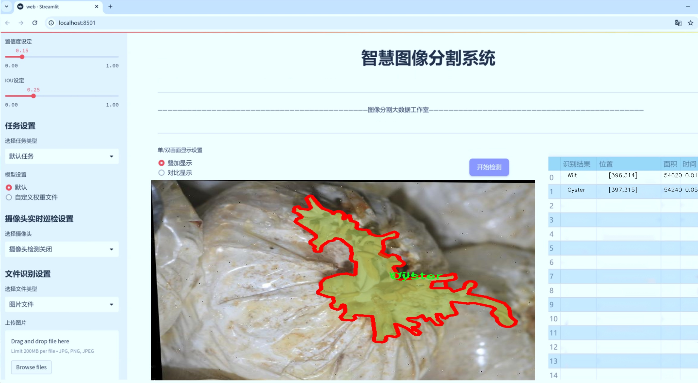
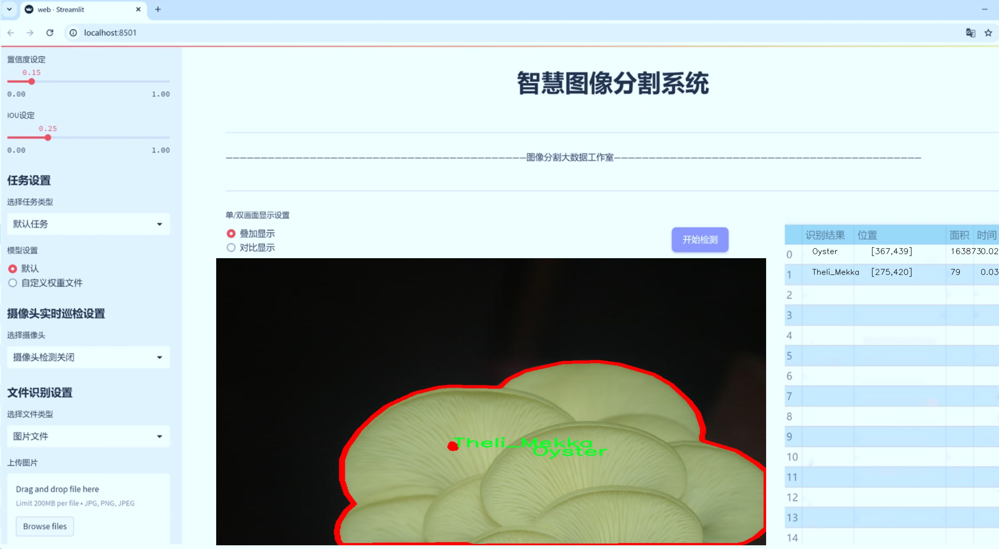
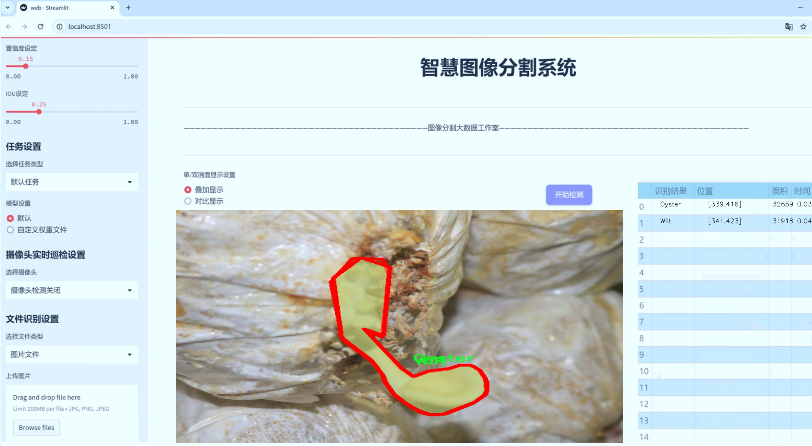
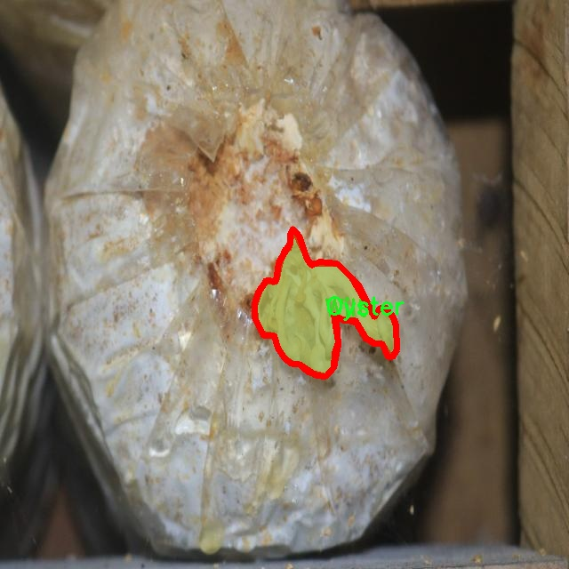
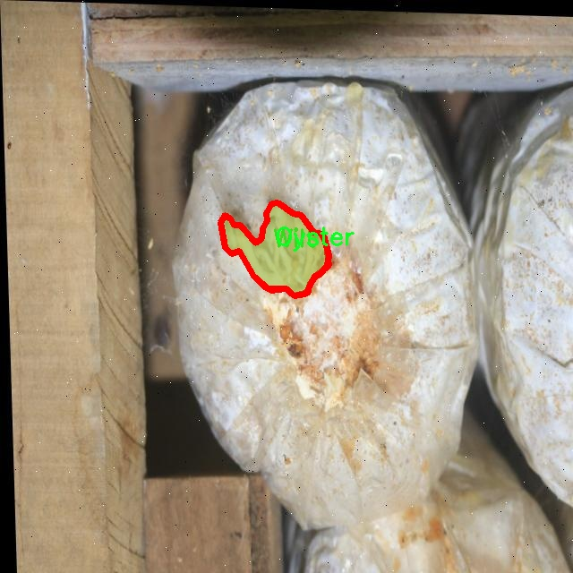
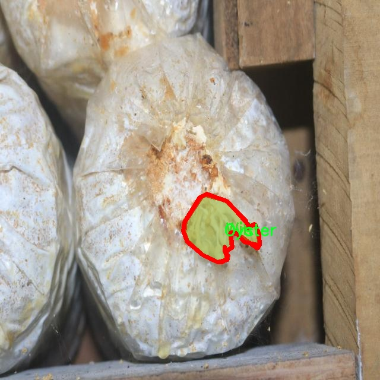
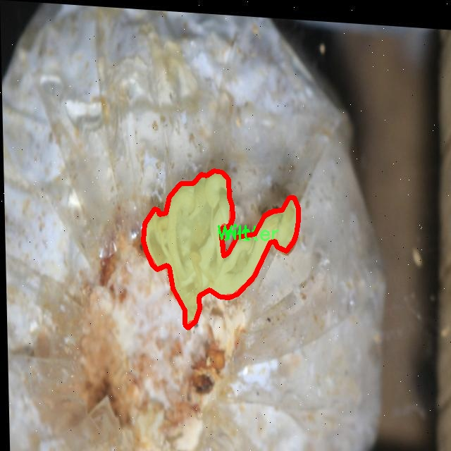
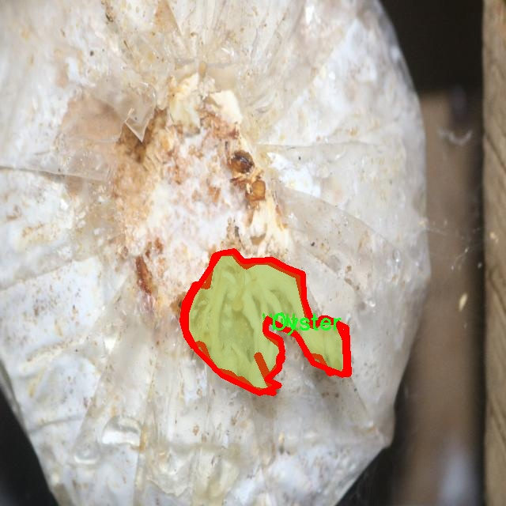

# 蘑菇健康状况分割系统： yolov8-seg-RCSOSA

### 1.研究背景与意义

[参考博客](https://gitee.com/YOLOv8_YOLOv11_Segmentation_Studio/projects)

[博客来源](https://kdocs.cn/l/cszuIiCKVNis)

研究背景与意义

随着全球人口的不断增长和城市化进程的加快，农业生产面临着前所未有的挑战。蘑菇作为一种重要的食用菌，不仅富含营养，且具有良好的经济价值，已成为现代农业中不可或缺的一部分。然而，蘑菇的健康状况直接影响其产量和品质，因此，及时、准确地监测和评估蘑菇的健康状况显得尤为重要。传统的人工检测方法不仅耗时耗力，而且容易受到主观因素的影响，导致检测结果的不准确性。因此，开发一种高效、准确的蘑菇健康状况分割系统，成为当前农业智能化发展的重要研究方向。

近年来，深度学习技术的迅猛发展为图像处理和计算机视觉领域带来了新的机遇。YOLO（You Only Look Once）系列模型因其实时性和高准确性，在目标检测和实例分割任务中表现出色。YOLOv8作为该系列的最新版本，结合了多种先进的网络结构和算法优化，能够在复杂环境中实现高效的目标检测和分割。基于YOLOv8的蘑菇健康状况分割系统，不仅能够提高检测的准确性，还能大幅度提升检测的速度，为农业生产提供实时监测的可能性。

本研究将利用包含1300张图像的蘑菇数据集，进行健康状况的实例分割。该数据集包含四个类别：健康、牡蛎、Theli_Mekka和枯萎。通过对这些类别的深入分析，我们可以更好地理解不同健康状况的蘑菇在外观特征上的差异，从而为模型的训练提供更为丰富的样本支持。尤其是在实际应用中，能够有效区分健康与病态蘑菇，将为农民提供科学的决策依据，帮助他们及时采取措施，降低损失，提高产量。

此外，研究的意义还在于推动农业智能化的进程。通过将深度学习与农业生产相结合，不仅可以提高生产效率，还能促进可持续发展。蘑菇健康状况的自动化监测，将为农业生产提供更为科学的管理手段，减少对化学药剂的依赖，降低环境污染风险。同时，基于改进YOLOv8的分割系统，能够为其他农作物的健康监测提供借鉴，推动整个农业领域的智能化转型。

综上所述，基于改进YOLOv8的蘑菇健康状况分割系统的研究，不仅具有重要的理论价值，还有着广泛的实际应用前景。通过深入探讨蘑菇健康状况的检测与分析，我们希望能够为农业生产提供新的思路和方法，助力农业现代化进程，推动食品安全和可持续发展目标的实现。

### 2.图片演示







注意：本项目提供完整的训练源码数据集和训练教程,由于此博客编辑较早,暂不提供权重文件（best.pt）,需要按照6.训练教程进行训练后实现上图效果。

### 3.视频演示

[3.1 视频演示](https://www.bilibili.com/video/BV1kNzzYnE6U/)

### 4.数据集信息

##### 4.1 数据集类别数＆类别名

nc: 4
names: ['Healthy', 'Oyster', 'Theli_Mekka', 'Wilt']


##### 4.2 数据集信息简介

数据集信息展示

在本研究中，我们使用了名为“mushroom”的数据集，以训练和改进YOLOv8-seg模型，旨在实现对蘑菇健康状况的精确分割与识别。该数据集专门设计用于蘑菇的健康状况分析，涵盖了四个主要类别，分别是“Healthy”（健康）、“Oyster”（牡蛎蘑菇）、“Theli_Mekka”（特利梅卡蘑菇）和“Wilt”（枯萎）。这些类别的选择不仅反映了蘑菇在自然环境中的多样性，也为模型的训练提供了丰富的样本数据，使其能够更好地适应不同的生长状态和病害表现。

数据集的构建过程中，研究团队通过精心筛选和标注了大量的蘑菇图像，确保每个类别的样本数量充足且具有代表性。每一类蘑菇的图像都经过严格的质量控制，以保证其在光照、角度和背景等方面的多样性。这种多样性对于模型的泛化能力至关重要，因为它能够帮助模型学习到更为丰富的特征，从而在实际应用中提高识别的准确性。

在数据集的标注过程中，研究人员采用了先进的图像标注工具，确保每一张图像中的蘑菇都被准确地标记。标注不仅包括了蘑菇的类别信息，还涵盖了其健康状况的细节。例如，健康的蘑菇通常具有鲜艳的颜色和完整的形态，而枯萎的蘑菇则可能表现出颜色暗淡、形态扭曲等特征。通过这种细致的标注，数据集为YOLOv8-seg模型提供了丰富的训练素材，使其能够在不同的环境和条件下有效地识别和分割出不同类别的蘑菇。

在训练过程中，数据集的多样性和丰富性使得模型能够更好地学习到各类蘑菇的特征，尤其是在处理复杂背景和光照变化时。通过不断迭代和优化，模型能够逐渐提高对各类蘑菇的识别精度，尤其是在健康与病态之间的微妙差异。这对于农业生产和食品安全具有重要意义，因为及时识别出病态蘑菇可以有效减少病害传播，提高农作物的产量和质量。

此外，数据集的设计还考虑到了实际应用中的可扩展性和适应性。随着更多蘑菇种类和健康状况的出现，数据集可以不断更新和扩充，以满足未来研究和应用的需求。这种灵活性不仅为当前的研究提供了支持，也为后续的工作奠定了基础，使得模型能够在更广泛的场景中发挥作用。

总之，“mushroom”数据集为改进YOLOv8-seg的蘑菇健康状况分割系统提供了坚实的基础。通过对数据集的深入分析和有效利用，我们期望能够实现更高效的蘑菇健康监测，为农业科技的发展贡献一份力量。











### 5.项目依赖环境部署教程（零基础手把手教学）

[5.1 环境部署教程链接（零基础手把手教学）](https://www.bilibili.com/video/BV1jG4Ve4E9t/?vd_source=bc9aec86d164b67a7004b996143742dc)


[5.2 安装Python虚拟环境创建和依赖库安装视频教程链接（零基础手把手教学）](https://www.bilibili.com/video/BV1nA4VeYEze/?vd_source=bc9aec86d164b67a7004b996143742dc)

### 6.手把手YOLOV8-seg训练视频教程（零基础手把手教学）

[6.1 手把手YOLOV8-seg训练视频教程（零基础小白有手就能学会）](https://www.bilibili.com/video/BV1cA4VeYETe/?vd_source=bc9aec86d164b67a7004b996143742dc)


按照上面的训练视频教程链接加载项目提供的数据集，运行train.py即可开始训练



     Epoch   gpu_mem       box       obj       cls    labels  img_size
     1/200     0G   0.01576   0.01955  0.007536        22      1280: 100%|██████████| 849/849 [14:42<00:00,  1.04s/it]
               Class     Images     Labels          P          R     mAP@.5 mAP@.5:.95: 100%|██████████| 213/213 [01:14<00:00,  2.87it/s]
                 all       3395      17314      0.994      0.957      0.0957      0.0843

     Epoch   gpu_mem       box       obj       cls    labels  img_size
     2/200     0G   0.01578   0.01923  0.007006        22      1280: 100%|██████████| 849/849 [14:44<00:00,  1.04s/it]
               Class     Images     Labels          P          R     mAP@.5 mAP@.5:.95: 100%|██████████| 213/213 [01:12<00:00,  2.95it/s]
                 all       3395      17314      0.996      0.956      0.0957      0.0845

     Epoch   gpu_mem       box       obj       cls    labels  img_size
     3/200     0G   0.01561    0.0191  0.006895        27      1280: 100%|██████████| 849/849 [10:56<00:00,  1.29it/s]
               Class     Images     Labels          P          R     mAP@.5 mAP@.5:.95: 100%|███████   | 187/213 [00:52<00:00,  4.04it/s]
                 all       3395      17314      0.996      0.957      0.0957      0.0845


### 7.50+种全套YOLOV8-seg创新点加载调参实验视频教程（一键加载写好的改进模型的配置文件）

[7.1 50+种全套YOLOV8-seg创新点加载调参实验视频教程（一键加载写好的改进模型的配置文件）](https://www.bilibili.com/video/BV1Hw4VePEXv/?vd_source=bc9aec86d164b67a7004b996143742dc)

### YOLOV8-seg算法简介

原始YOLOv8-seg算法原理

YOLOv8-seg算法是YOLO系列中的最新版本，结合了目标检测与图像分割的能力，标志着计算机视觉领域的一次重要进步。作为一种单阶段检测算法，YOLOv8-seg不仅在检测精度和速度上进行了优化，还在模型结构和训练策略上进行了多项创新，使其在处理复杂场景时表现出色。

YOLOv8-seg的网络结构由四个主要部分组成：输入模块、Backbone骨干网络、Neck特征融合网络和Head检测模块。输入模块负责对输入图像进行预处理，包括调整图像比例、实现Mosaic增强以及瞄点计算等。这些预处理步骤不仅提高了模型的训练效率，还增强了其对不同场景的适应能力。

在Backbone部分，YOLOv8-seg延续了DarkNet的设计理念，但在此基础上进行了重要的改进。YOLOv8采用了C2f模块替代了传统的C3模块，这一变化显著增强了网络的梯度流动性。C2f模块通过引入更多的残差连接，使得特征提取过程更加高效，同时保持了模型的轻量级特性。这一设计使得YOLOv8-seg能够在不同尺度的目标检测中获得更丰富的特征信息，从而提升了检测的准确性。

特征融合网络Neck部分则采用了“双塔结构”，结合了特征金字塔（FPN）和路径聚合网络（PAN），以促进语义特征和定位特征的有效转移。这种结构的优势在于，它能够充分利用不同层次的特征信息，增强了对多尺度目标的检测能力。在YOLOv8-seg中，特征融合的过程不仅提高了特征的表达能力，还增强了模型对复杂场景的适应性。

在Head检测模块中，YOLOv8-seg引入了解耦头的结构，将分类和回归任务分离开来。这一创新使得模型在处理复杂场景时能够更加专注于各自的任务，从而有效解决了传统方法中定位不准和分类错误的问题。通过解耦，YOLOv8-seg能够更快速地收敛，进一步提升了模型的整体性能。

YOLOv8-seg的另一大创新在于其采用了Anchor-free目标检测方法。这种方法摒弃了传统的锚点框设计，直接通过回归方式预测目标的位置和大小。这一设计的优势在于，网络能够更快地聚焦于目标位置的邻近点，使得预测框更接近于实际边界框区域，进而提高了检测的精度和效率。

在训练过程中，YOLOv8-seg还采用了动态的Task-Aligned Assigner样本分配策略，并在最后10个epoch中关闭了Mosaic增强。这些策略的实施旨在优化模型的训练过程，使其在不同任务之间能够更好地协调和分配资源，进一步提升了模型的泛化能力。

此外，YOLOv8-seg在损失计算方面也进行了优化，采用了BCELoss作为分类损失，以及DFLLoss和CIoULoss作为回归损失。这种损失函数的选择使得模型在训练过程中能够更好地平衡分类和回归任务的权重，从而提升了整体的检测性能。

总的来说，YOLOv8-seg算法通过一系列的结构优化和训练策略创新，成功地将目标检测与图像分割相结合，展现出卓越的性能。其在实时检测和复杂场景处理中的优势，使其成为计算机视觉领域中一个极具潜力的工具。随着YOLOv8-seg的不断发展和应用，未来在智能监控、自动驾驶、医疗影像等领域的应用前景将更加广阔。


### 9.系统功能展示（检测对象为举例，实际内容以本项目数据集为准）

图9.1.系统支持检测结果表格显示

  图9.2.系统支持置信度和IOU阈值手动调节

  图9.3.系统支持自定义加载权重文件best.pt(需要你通过步骤5中训练获得)

  图9.4.系统支持摄像头实时识别

  图9.5.系统支持图片识别

  图9.6.系统支持视频识别

  图9.7.系统支持识别结果文件自动保存

  图9.8.系统支持Excel导出检测结果数据


### 10.50+种全套YOLOV8-seg创新点原理讲解（非科班也可以轻松写刊发刊，V11版本正在科研待更新）

#### 10.1 由于篇幅限制，每个创新点的具体原理讲解就不一一展开，具体见下列网址中的创新点对应子项目的技术原理博客网址【Blog】：


[10.1 50+种全套YOLOV8-seg创新点原理讲解链接](https://gitee.com/qunmasj/good)

#### 10.2 部分改进模块原理讲解(完整的改进原理见上图和技术博客链接)【如果此小节的图加载失败可以通过CSDN或者Github搜索该博客的标题访问原始博客，原始博客图片显示正常】

### YOLOv8简介
YOLOv8是一种目标检测模型，是基于YOLO (You Only Look Once)系列算法发展而来的最新版本。它的核心思想是将目标检测任务转化为一个回归问题，通过单次前向传播即可直接预测出图像中的多个目标的位置和类别。
YOLOv8的网络结构采用了Darknet作为其主干网络，主要由卷积层和池化层构成。与之前的版本相比，YOLOv8在网络结构上进行了改进，引入了更多的卷积层和残差模块，以提高模型的准确性和鲁棒性。
YOLOv8采用了一种特征金字塔网络(Feature Pyramid Network,FPN)的结构，通过在不同层级上融合多尺度的特征信息，可以对不同尺度的目标进行有效的检测。此外，YOLOv8还引入了一种自适应感知域(Adaptive Anchors
的机制，通过自适应地学习目标的尺度和
长宽比，提高了模型对于不同尺度和形状目标的检测效果。
总体来说，YOLOv8结构模型综合了多个先进的目标检测技术，在保证检测速度的同时提升了检测精度和鲁棒性，被广泛应用于实时目标检测任务中。


#### yolov8网络模型结构图

YOLOv8 (You Only Look Once version 8)是一种目标检测算法，它在实时场景下可以快速准确地检测图像中的目标。
YOLOv8的网络模型结构基于Darknet框架，由一系列卷积层、池化层和全连接层组成。主要包含以下几个组件:
1.输入层:接收输入图像。
2.卷积层:使用不同尺寸的卷积核来提取图像特征。
3.残差块(Residual blocks):通过使用跳跃连接(skip connections）来解决梯度消失问题，使得网络更容易训练。
4.上采样层(Upsample layers):通过插值操作将特征图的尺寸放大，以便在不同尺度上进行目标检测。
5.池化层:用于减小特征图的尺寸，同时保留重要的特征。
6.1x1卷积层:用于降低通道数，减少网络参数量。
7.3x3卷积层:用于进—步提取和组合特征。
8.全连接层:用于最后的目标分类和定位。
YOLOv8的网络结构采用了多个不同尺度的特征图来检测不同大小的目标，从而提高了目标检测的准确性和多尺度性能。
请注意，YOLOv8网络模型结构图的具体细节可能因YOLO版本和实现方式而有所不同。


#### yolov8模型结构
YOLOv8模型是一种目标检测模型，其结构是基于YOLOv3模型进行改进的。模型结构可以分为主干网络和检测头两个部分。
主干网络是一种由Darknet-53构成的卷积神经网络。Darknet-53是一个经过多层卷积和残差连接构建起来的深度神经网络。它能够提取图像的特征信息，并将这些信息传递给检测头。
检测头是YOLOv8的关键部分，它负责在图像中定位和识别目标。检测头由一系列卷积层和全连接层组成。在每个检测头中，会生成一组锚框，并针对每个锚框预测目标的类别和位置信息。
YOLOv8模型使用了预训练的权重，其中在COCO数据集上进行了训练。这意味着该模型已经通过大规模数据集的学习，具有一定的目标检测能力。

### RT-DETR骨干网络HGNetv2简介
#### RT-DETR横空出世
前几天被百度的RT-DETR刷屏，参考该博客提出的目标检测新范式对原始DETR的网络结构进行了调整和优化，以提高计算速度和减小模型大小。这包括使用更轻量级的基础网络和调整Transformer结构。并且，摒弃了nms处理的detr结构与传统的物体检测方法相比，不仅训练是端到端的，检测也能端到端，这意味着整个网络在训练过程中一起进行优化，推理过程不需要昂贵的后处理代价，这有助于提高模型的泛化能力和性能。


当然，人们对RT-DETR之所以产生浓厚的兴趣，我觉得大概率还是对YOLO系列审美疲劳了，就算是出到了YOLO10086，我还是只想用YOLOv5和YOLOv7的框架来魔改做业务。。

#### 初识HGNet
看到RT-DETR的性能指标，发现指标最好的两个模型backbone都是用的HGNetv2，毫无疑问，和当时的picodet一样，骨干都是使用百度自家的网络。初识HGNet的时候，当时是参加了第四届百度网盘图像处理大赛，文档图像方向识别专题赛道，简单来说，就是使用分类网络对一些文档截图或者图片进行方向角度分类。


当时的方案并没有那么快定型，通常是打榜过程发现哪个网络性能好就使用哪个网络做魔改，而且木有显卡，只能蹭Ai Studio的平台，不过v100一天8小时的实验时间有点短，这也注定了大模型用不了。 

流水的模型，铁打的炼丹人，最后发现HGNet-tiny各方面指标都很符合我们的预期，后面就一直围绕它魔改。当然，比赛打榜是目的，学习才是享受过程，当时看到效果还可以，便开始折腾起了HGNet的网络架构，我们可以看到，PP-HGNet 针对 GPU 设备，对目前 GPU 友好的网络做了分析和归纳，尽可能多的使用 3x3 标准卷积（计算密度最高），PP-HGNet是由多个HG-Block组成，细节如下：


ConvBNAct是啥？简单聊一聊，就是Conv+BN+Act，CV Man应该最熟悉不过了：
```python
class ConvBNAct(TheseusLayer):
    def __init__(self,
                 in_channels,
                 out_channels,
                 kernel_size,
                 stride,
                 groups=1,
                 use_act=True):
        super().__init__()
        self.use_act = use_act
        self.conv = Conv2D(
            in_channels,
            out_channels,
            kernel_size,
            stride,
            padding=(kernel_size - 1) // 2,
            groups=groups,
            bias_attr=False)
        self.bn = BatchNorm2D(
            out_channels,
            weight_attr=ParamAttr(regularizer=L2Decay(0.0)),
            bias_attr=ParamAttr(regularizer=L2Decay(0.0)))
        if self.use_act:
            self.act = ReLU()
 
    def forward(self, x):
        x = self.conv(x)
        x = self.bn(x)
        if self.use_act:
            x = self.act(x)
        return x 
```
且标准卷积的数量随层数深度增加而增多，从而得到一个有利于 GPU 推理的骨干网络，同样速度下，精度也超越其他 CNN ，性价比也优于ViT-base模型。


另外，我们可以看到：

PP-HGNet 的第一层由channel为96的Stem模块构成，目的是为了减少参数量和计算量。PP-HGNet

Tiny的整体结构由四个HG Stage构成，而每个HG Stage主要由包含大量标准卷积的HG Block构成。

PP-HGNet的第三到第五层使用了使用了可学习的下采样层（LDS Layer），该层group为输入通道数，可达到降参降计算量的作用，且Tiny模型仅包含三个LDS Layer，并不会对GPU的利用率造成较大影响.

PP-HGNet的激活函数为Relu，常数级操作可保证该模型在硬件上的推理速度。

### 11.项目核心源码讲解（再也不用担心看不懂代码逻辑）

#### 11.1 ultralytics\models\sam\modules\decoders.py

以下是经过精简和注释的核心代码部分，保留了主要功能并添加了详细的中文注释：

```python
import torch
from torch import nn
from torch.nn import functional as F
from ultralytics.nn.modules import LayerNorm2d

class MaskDecoder(nn.Module):
    """
    MaskDecoder类用于生成掩码及其质量评分，采用变换器架构根据图像和提示嵌入预测掩码。
    """

    def __init__(self, transformer_dim: int, transformer: nn.Module, num_multimask_outputs: int = 3, 
                 activation: Type[nn.Module] = nn.GELU, iou_head_depth: int = 3, 
                 iou_head_hidden_dim: int = 256) -> None:
        """
        初始化MaskDecoder。

        Args:
            transformer_dim (int): 变换器模块的通道维度
            transformer (nn.Module): 用于预测掩码的变换器
            num_multimask_outputs (int): 预测的掩码数量
            activation (nn.Module): 上采样时使用的激活函数类型
            iou_head_depth (int): 用于预测掩码质量的MLP深度
            iou_head_hidden_dim (int): 用于预测掩码质量的MLP隐藏维度
        """
        super().__init__()
        self.transformer_dim = transformer_dim
        self.transformer = transformer
        self.num_multimask_outputs = num_multimask_outputs

        # IoU token和mask tokens的嵌入
        self.iou_token = nn.Embedding(1, transformer_dim)
        self.mask_tokens = nn.Embedding(num_multimask_outputs + 1, transformer_dim)

        # 输出上采样网络
        self.output_upscaling = nn.Sequential(
            nn.ConvTranspose2d(transformer_dim, transformer_dim // 4, kernel_size=2, stride=2),
            LayerNorm2d(transformer_dim // 4),
            activation(),
            nn.ConvTranspose2d(transformer_dim // 4, transformer_dim // 8, kernel_size=2, stride=2),
            activation(),
        )

        # 用于生成掩码的超网络MLP
        self.output_hypernetworks_mlps = nn.ModuleList([
            MLP(transformer_dim, transformer_dim, transformer_dim // 8, 3) for _ in range(num_multimask_outputs + 1)
        ])

        # 预测掩码质量的MLP
        self.iou_prediction_head = MLP(transformer_dim, iou_head_hidden_dim, num_multimask_outputs + 1, iou_head_depth)

    def forward(self, image_embeddings: torch.Tensor, image_pe: torch.Tensor, 
                sparse_prompt_embeddings: torch.Tensor, dense_prompt_embeddings: torch.Tensor, 
                multimask_output: bool) -> Tuple[torch.Tensor, torch.Tensor]:
        """
        根据图像和提示嵌入预测掩码。

        Args:
            image_embeddings (torch.Tensor): 图像编码器的嵌入
            image_pe (torch.Tensor): 图像嵌入的位置信息
            sparse_prompt_embeddings (torch.Tensor): 稀疏提示的嵌入
            dense_prompt_embeddings (torch.Tensor): 密集提示的嵌入
            multimask_output (bool): 是否返回多个掩码

        Returns:
            torch.Tensor: 预测的掩码
            torch.Tensor: 掩码质量的预测
        """
        masks, iou_pred = self.predict_masks(image_embeddings, image_pe, sparse_prompt_embeddings, dense_prompt_embeddings)

        # 根据是否需要多个掩码选择输出
        mask_slice = slice(1, None) if multimask_output else slice(0, 1)
        masks = masks[:, mask_slice, :, :]
        iou_pred = iou_pred[:, mask_slice]

        return masks, iou_pred

    def predict_masks(self, image_embeddings: torch.Tensor, image_pe: torch.Tensor, 
                      sparse_prompt_embeddings: torch.Tensor, dense_prompt_embeddings: torch.Tensor) -> Tuple[torch.Tensor, torch.Tensor]:
        """
        预测掩码。

        Args:
            image_embeddings (torch.Tensor): 图像编码器的嵌入
            image_pe (torch.Tensor): 图像嵌入的位置信息
            sparse_prompt_embeddings (torch.Tensor): 稀疏提示的嵌入
            dense_prompt_embeddings (torch.Tensor): 密集提示的嵌入

        Returns:
            Tuple[torch.Tensor, torch.Tensor]: 预测的掩码和IoU预测
        """
        # 连接输出tokens
        output_tokens = torch.cat([self.iou_token.weight, self.mask_tokens.weight], dim=0)
        output_tokens = output_tokens.unsqueeze(0).expand(sparse_prompt_embeddings.size(0), -1, -1)
        tokens = torch.cat((output_tokens, sparse_prompt_embeddings), dim=1)

        # 扩展每张图像的数据以适应每个掩码
        src = torch.repeat_interleave(image_embeddings, tokens.shape[0], dim=0) + dense_prompt_embeddings
        pos_src = torch.repeat_interleave(image_pe, tokens.shape[0], dim=0)

        # 运行变换器
        hs, src = self.transformer(src, pos_src, tokens)
        iou_token_out = hs[:, 0, :]
        mask_tokens_out = hs[:, 1:(1 + self.num_multimask_outputs + 1), :]

        # 上采样掩码嵌入并预测掩码
        src = src.transpose(1, 2).view(src.shape[0], self.transformer_dim, -1)
        upscaled_embedding = self.output_upscaling(src)
        hyper_in_list = [self.output_hypernetworks_mlps[i](mask_tokens_out[:, i, :]) for i in range(self.num_multimask_outputs + 1)]
        hyper_in = torch.stack(hyper_in_list, dim=1)
        masks = (hyper_in @ upscaled_embedding.view(src.shape[0], -1)).view(src.shape[0], -1, int(src.shape[2]**0.5), int(src.shape[2]**0.5))

        # 生成掩码质量预测
        iou_pred = self.iou_prediction_head(iou_token_out)

        return masks, iou_pred

class MLP(nn.Module):
    """
    MLP（多层感知器）模型。
    """

    def __init__(self, input_dim: int, hidden_dim: int, output_dim: int, num_layers: int, 
                 sigmoid_output: bool = False) -> None:
        """
        初始化MLP。

        Args:
            input_dim (int): 输入特征的维度
            hidden_dim (int): 隐藏层的维度
            output_dim (int): 输出层的维度
            num_layers (int): 隐藏层的数量
            sigmoid_output (bool): 是否对输出层应用sigmoid激活
        """
        super().__init__()
        self.num_layers = num_layers
        h = [hidden_dim] * (num_layers - 1)
        self.layers = nn.ModuleList(nn.Linear(n, k) for n, k in zip([input_dim] + h, h + [output_dim]))
        self.sigmoid_output = sigmoid_output

    def forward(self, x):
        """执行前向传播并应用激活函数。"""
        for i, layer in enumerate(self.layers):
            x = F.relu(layer(x)) if i < self.num_layers - 1 else layer(x)
        if self.sigmoid_output:
            x = torch.sigmoid(x)
        return x
```

### 代码说明：
1. **MaskDecoder类**：负责生成掩码和掩码质量评分，使用变换器架构。
   - **初始化方法**：设置变换器维度、变换器模型、IoU token、掩码 tokens 及其相关的上采样网络和MLP。
   - **forward方法**：接收图像和提示嵌入，调用`predict_masks`方法生成掩码和IoU预测，并根据需要选择输出的掩码。
   - **predict_masks方法**：连接IoU token和掩码 tokens，运行变换器，生成掩码和IoU预测。

2. **MLP类**：实现一个简单的多层感知器，用于掩码质量预测。
   - **初始化方法**：定义输入、隐藏和输出层的维度，以及层数。
   - **forward方法**：执行前向传播，并在最后一层应用激活函数（可选）。

此代码的核心在于`MaskDecoder`类的`forward`和`predict_masks`方法，它们实现了掩码的生成和质量预测。

这个文件定义了一个名为 `MaskDecoder` 的类，主要用于生成图像的掩码及其相关的质量评分。该类使用了变换器（transformer）架构来根据图像和提示嵌入（prompt embeddings）预测掩码。以下是对该文件的详细分析。

首先，`MaskDecoder` 类的构造函数 `__init__` 接受多个参数，包括变换器的维度、变换器模块、要预测的掩码数量、激活函数类型、IoU（Intersection over Union）头的深度和隐藏维度等。构造函数中初始化了一些重要的属性，例如用于表示 IoU 的嵌入层、掩码令牌的嵌入层、输出上采样的神经网络序列，以及用于生成掩码的超网络 MLP 列表和用于预测掩码质量的 MLP。

在 `forward` 方法中，输入包括图像嵌入、图像的位置信息、稀疏提示嵌入和密集提示嵌入。该方法首先调用 `predict_masks` 方法来预测掩码和 IoU 评分。根据 `multimask_output` 参数的值，选择输出单个掩码或多个掩码，并返回预测的掩码和对应的质量评分。

`predict_masks` 方法是掩码预测的核心。它首先将 IoU 令牌和掩码令牌进行拼接，并扩展到每个图像的批次中。接着，将图像嵌入与密集提示嵌入相加，并通过变换器进行处理。变换器的输出包括 IoU 令牌的输出和掩码令牌的输出。随后，对掩码嵌入进行上采样，并通过超网络 MLP 生成最终的掩码。最后，使用 IoU 头来生成掩码质量的预测。

此外，文件中还定义了一个 `MLP` 类，表示多层感知器（Multi-Layer Perceptron）。该类的构造函数接受输入维度、隐藏层维度、输出维度和层数等参数，并构建相应的线性层。在 `forward` 方法中，依次通过每一层进行前向传播，并在最后一层之前应用 ReLU 激活函数，最后根据需要应用 Sigmoid 激活函数。

总的来说，这个文件实现了一个用于掩码生成的解码器模块，结合了变换器架构和多层感知器，能够根据输入的图像和提示信息生成高质量的掩码及其评分，适用于图像分割等任务。

#### 11.2 ultralytics\models\sam\modules\transformer.py

以下是经过简化并添加详细中文注释的核心代码部分：

```python
import math
import torch
from torch import Tensor, nn

class Attention(nn.Module):
    """实现一个注意力层，支持对查询、键和值的投影，并可选择性地下采样。"""

    def __init__(self, embedding_dim: int, num_heads: int, downsample_rate: int = 1) -> None:
        """
        初始化注意力层。

        Args:
            embedding_dim (int): 输入嵌入的维度。
            num_heads (int): 注意力头的数量。
            downsample_rate (int, optional): 内部维度的下采样因子，默认为1。
        """
        super().__init__()
        self.embedding_dim = embedding_dim
        self.internal_dim = embedding_dim // downsample_rate  # 计算内部维度
        self.num_heads = num_heads
        assert self.internal_dim % num_heads == 0, 'num_heads必须能整除internal_dim.'

        # 定义线性层用于查询、键和值的投影
        self.q_proj = nn.Linear(embedding_dim, self.internal_dim)
        self.k_proj = nn.Linear(embedding_dim, self.internal_dim)
        self.v_proj = nn.Linear(embedding_dim, self.internal_dim)
        self.out_proj = nn.Linear(self.internal_dim, embedding_dim)  # 输出层

    @staticmethod
    def _separate_heads(x: Tensor, num_heads: int) -> Tensor:
        """将输入张量分离为指定数量的注意力头。"""
        b, n, c = x.shape  # b: 批量大小, n: 序列长度, c: 特征维度
        x = x.reshape(b, n, num_heads, c // num_heads)  # 重新调整形状
        return x.transpose(1, 2)  # B x N_heads x N_tokens x C_per_head

    @staticmethod
    def _recombine_heads(x: Tensor) -> Tensor:
        """将分离的注意力头重新组合为单个张量。"""
        b, n_heads, n_tokens, c_per_head = x.shape
        x = x.transpose(1, 2)  # 转置以便于重组
        return x.reshape(b, n_tokens, n_heads * c_per_head)  # B x N_tokens x C

    def forward(self, q: Tensor, k: Tensor, v: Tensor) -> Tensor:
        """计算给定输入查询、键和值张量的注意力输出。"""

        # 输入投影
        q = self.q_proj(q)  # 投影查询
        k = self.k_proj(k)  # 投影键
        v = self.v_proj(v)  # 投影值

        # 分离为多个头
        q = self._separate_heads(q, self.num_heads)
        k = self._separate_heads(k, self.num_heads)
        v = self._separate_heads(v, self.num_heads)

        # 计算注意力
        _, _, _, c_per_head = q.shape
        attn = q @ k.permute(0, 1, 3, 2)  # 计算注意力分数
        attn = attn / math.sqrt(c_per_head)  # 缩放
        attn = torch.softmax(attn, dim=-1)  # 应用softmax

        # 获取输出
        out = attn @ v  # 计算加权和
        out = self._recombine_heads(out)  # 重新组合头
        return self.out_proj(out)  # 投影到输出维度
```

### 代码核心部分说明：
1. **Attention类**：实现了一个基本的注意力机制，支持对输入的查询、键和值进行线性投影，并计算注意力输出。
2. **初始化方法**：定义了输入的维度、注意力头的数量和可选的下采样率，并创建了用于投影的线性层。
3. **分离和重组头**：提供了将输入张量分离为多个注意力头和将它们重新组合为单个张量的静态方法。
4. **前向传播方法**：计算注意力输出，包括输入的投影、分离、注意力计算和输出的重组。

这个程序文件定义了一个名为 `TwoWayTransformer` 的类，它是一个双向变换器模块，能够同时关注图像和查询点。该类主要用于处理图像相关的任务，如目标检测、图像分割和点云处理。该类的构造函数接受多个参数，包括变换器的层数、嵌入维度、头数、MLP块的维度以及激活函数等。在初始化过程中，程序创建了多个 `TwoWayAttentionBlock` 层，并将它们存储在一个模块列表中。最后，程序还定义了一个最终的注意力层和一个层归一化层。

在 `forward` 方法中，输入的图像嵌入、图像的位置信息和查询点的嵌入被处理。首先，图像嵌入被展平并重新排列，以便与查询点的嵌入进行处理。接着，程序依次通过每个注意力层，更新查询和键的嵌入。最后，程序通过最终的注意力层和层归一化层，返回处理后的查询和键的嵌入。

此外，文件中还定义了 `TwoWayAttentionBlock` 类，它实现了一个注意力块，执行自注意力和交叉注意力的操作。该类的构造函数同样接受多个参数，并初始化了自注意力层、交叉注意力层、MLP块和多个层归一化层。在 `forward` 方法中，首先对查询进行自注意力处理，然后进行交叉注意力处理，接着通过 MLP 块进行处理，最后再次进行交叉注意力处理，返回更新后的查询和键的嵌入。

最后，文件中还定义了一个 `Attention` 类，它实现了一个基本的注意力机制。该类的构造函数初始化了输入嵌入的维度、头数和下采样率，并定义了用于查询、键和值的线性投影层。在 `forward` 方法中，输入的查询、键和值被投影并分离成多个头，然后计算注意力输出，最后将结果重新组合并输出。

总体来说，这个文件实现了一个复杂的双向变换器结构，结合了自注意力和交叉注意力机制，适用于多种计算机视觉任务。

#### 11.3 ultralytics\solutions\ai_gym.py

以下是代码中最核心的部分，并附上详细的中文注释：

```python
import cv2
from ultralytics.utils.plotting import Annotator

class AIGym:
    """管理实时视频流中人们姿势的健身步骤的类。"""

    def __init__(self):
        """初始化AIGym，设置视觉和图像参数的默认值。"""
        self.im0 = None  # 当前帧图像
        self.tf = None   # 线条厚度
        self.keypoints = None  # 姿势关键点
        self.poseup_angle = None  # 上升姿势的角度阈值
        self.posedown_angle = None  # 下降姿势的角度阈值
        self.threshold = 0.001  # 阈值，用于判断姿势变化
        self.angle = None  # 存储当前角度
        self.count = None  # 存储计数
        self.stage = None  # 存储当前阶段
        self.pose_type = 'pushup'  # 姿势类型，默认为俯卧撑
        self.kpts_to_check = None  # 用于计数的关键点
        self.view_img = False  # 是否显示图像
        self.annotator = None  # 用于绘制的Annotator对象

    def set_args(self, kpts_to_check, line_thickness=2, view_img=False, pose_up_angle=145.0, pose_down_angle=90.0, pose_type='pullup'):
        """
        配置AIGym的参数，包括线条厚度、是否保存图像和查看图像的参数。
        Args:
            kpts_to_check (list): 用于计数的3个关键点
            line_thickness (int): 边界框的线条厚度
            view_img (bool): 是否显示图像
            pose_up_angle (float): 设置上升姿势的角度
            pose_down_angle (float): 设置下降姿势的角度
            pose_type: "pushup", "pullup" 或 "abworkout"
        """
        self.kpts_to_check = kpts_to_check
        self.tf = line_thickness
        self.view_img = view_img
        self.poseup_angle = pose_up_angle
        self.posedown_angle = pose_down_angle
        self.pose_type = pose_type

    def start_counting(self, im0, results, frame_count):
        """
        计数健身步骤的函数。
        Args:
            im0 (ndarray): 当前视频流的帧
            results: 姿势估计数据
            frame_count: 当前帧计数
        """
        self.im0 = im0  # 保存当前帧图像
        if frame_count == 1:
            # 初始化计数和角度
            self.count = [0] * len(results[0])
            self.angle = [0] * len(results[0])
            self.stage = ['-' for _ in results[0]]
        
        self.keypoints = results[0].keypoints.data  # 获取关键点数据
        self.annotator = Annotator(im0, line_width=2)  # 创建Annotator对象

        for ind, k in enumerate(reversed(self.keypoints)):
            # 计算姿势角度
            self.angle[ind] = self.annotator.estimate_pose_angle(
                k[int(self.kpts_to_check[0])].cpu(),
                k[int(self.kpts_to_check[1])].cpu(),
                k[int(self.kpts_to_check[2])].cpu()
            )
            self.im0 = self.annotator.draw_specific_points(k, self.kpts_to_check, shape=(640, 640), radius=10)

            # 根据姿势类型更新阶段和计数
            if self.pose_type == 'pushup':
                if self.angle[ind] > self.poseup_angle:
                    self.stage[ind] = 'up'
                if self.angle[ind] < self.posedown_angle and self.stage[ind] == 'up':
                    self.stage[ind] = 'down'
                    self.count[ind] += 1

            elif self.pose_type == 'pullup':
                if self.angle[ind] > self.poseup_angle:
                    self.stage[ind] = 'down'
                if self.angle[ind] < self.posedown_angle and self.stage[ind] == 'down':
                    self.stage[ind] = 'up'
                    self.count[ind] += 1

            # 绘制角度、计数和阶段信息
            self.annotator.plot_angle_and_count_and_stage(
                angle_text=self.angle[ind],
                count_text=self.count[ind],
                stage_text=self.stage[ind],
                center_kpt=k[int(self.kpts_to_check[1])],
                line_thickness=self.tf
            )

            self.annotator.kpts(k, shape=(640, 640), radius=1, kpt_line=True)  # 绘制关键点

        # 显示图像
        if self.view_img:
            cv2.imshow('Ultralytics YOLOv8 AI GYM', self.im0)
            if cv2.waitKey(1) & 0xFF == ord('q'):
                return

if __name__ == '__main__':
    AIGym()  # 创建AIGym实例
```

### 代码核心部分说明：
1. **类初始化**：`__init__`方法中定义了类的基本属性，包括图像、关键点、计数、角度和阶段等。
2. **参数设置**：`set_args`方法用于配置健身动作的参数，如关键点、线条厚度、姿势类型等。
3. **计数逻辑**：`start_counting`方法是核心功能，负责从视频流中获取当前帧，计算关键点的角度，并根据姿势类型更新计数和阶段。最后，使用Annotator绘制信息并显示图像。

这个程序文件定义了一个名为 `AIGym` 的类，主要用于在实时视频流中管理人们的健身动作（如俯卧撑、引体向上等）的计数和姿势检测。程序首先导入了 `cv2` 库和 `Annotator` 类，这些都是进行图像处理和绘制标注所需的工具。

在 `AIGym` 类的构造函数 `__init__` 中，初始化了一些基本的参数，包括图像、关键点、角度、计数和姿势状态等。这里定义了一些用于姿势检测的阈值和变量，比如 `pose_type` 用于指定当前的运动类型（如俯卧撑、引体向上或腹部锻炼），而 `kpts_to_check` 则用于存储需要检查的关键点。

`set_args` 方法用于配置 `AIGym` 的一些参数，包括需要检查的关键点、线条厚度、是否显示图像、上举和下放的角度等。这些参数的设置可以帮助程序更好地适应不同的健身动作和用户需求。

`start_counting` 方法是该类的核心功能，负责处理每一帧图像并进行动作计数。它接受当前帧图像、姿势估计结果和帧计数作为输入。在方法内部，首先会更新当前帧图像和关键点数据。如果是第一帧，则初始化计数、角度和阶段的列表。

接下来，程序会遍历每个关键点，根据当前的 `pose_type` 进行不同的处理。对于俯卧撑和引体向上，程序会计算关键点之间的角度，并根据角度判断运动的阶段（上或下）。在腹部锻炼的情况下，程序会根据角度变化更新计数，并绘制相关信息（如角度、计数和阶段）到图像上。

最后，如果设置了 `view_img` 为 `True`，程序会使用 OpenCV 显示当前处理的图像，并在按下 'q' 键时退出显示。

整体而言，这个程序实现了一个简单的健身动作监测系统，能够实时分析用户的运动姿势并进行计数，适用于健身房或家庭锻炼的场景。

#### 11.4 ultralytics\nn\modules\utils.py

以下是代码中最核心的部分，并附上详细的中文注释：

```python
import torch
import torch.nn.functional as F

def multi_scale_deformable_attn_pytorch(value: torch.Tensor, value_spatial_shapes: torch.Tensor,
                                        sampling_locations: torch.Tensor,
                                        attention_weights: torch.Tensor) -> torch.Tensor:
    """
    多尺度可变形注意力机制。

    参数:
    - value: 输入特征张量，形状为 (bs, C, num_heads, embed_dims)，
             其中 bs 是批量大小，C 是通道数，num_heads 是头数，embed_dims 是嵌入维度。
    - value_spatial_shapes: 特征图的空间形状，形状为 (num_levels, 2)，
                            每一行表示一个特征图的高度和宽度。
    - sampling_locations: 采样位置，形状为 (bs, num_queries, num_heads, num_levels, num_points, 2)。
    - attention_weights: 注意力权重，形状为 (bs, num_heads, num_queries, num_levels, num_points)。

    返回:
    - output: 经过多尺度可变形注意力机制处理后的输出张量，形状为 (bs, num_queries, num_heads * embed_dims)。
    """

    # 获取输入张量的形状信息
    bs, _, num_heads, embed_dims = value.shape
    _, num_queries, _, num_levels, num_points, _ = sampling_locations.shape

    # 将输入特征张量按照空间形状分割成多个特征图
    value_list = value.split([H_ * W_ for H_, W_ in value_spatial_shapes], dim=1)

    # 将采样位置进行归一化处理
    sampling_grids = 2 * sampling_locations - 1
    sampling_value_list = []

    # 遍历每个特征图的层级
    for level, (H_, W_) in enumerate(value_spatial_shapes):
        # 将特征图的形状调整为 (bs*num_heads, embed_dims, H_, W_)
        value_l_ = (value_list[level].flatten(2).transpose(1, 2).reshape(bs * num_heads, embed_dims, H_, W_))

        # 获取当前层级的采样网格
        sampling_grid_l_ = sampling_grids[:, :, :, level].transpose(1, 2).flatten(0, 1)

        # 使用双线性插值从特征图中采样
        sampling_value_l_ = F.grid_sample(value_l_,
                                          sampling_grid_l_,
                                          mode='bilinear',
                                          padding_mode='zeros',
                                          align_corners=False)
        sampling_value_list.append(sampling_value_l_)

    # 将注意力权重的形状调整为 (bs*num_heads, 1, num_queries, num_levels*num_points)
    attention_weights = attention_weights.transpose(1, 2).reshape(bs * num_heads, 1, num_queries,
                                                                  num_levels * num_points)

    # 计算最终的输出
    output = ((torch.stack(sampling_value_list, dim=-2).flatten(-2) * attention_weights).sum(-1).view(
        bs, num_heads * embed_dims, num_queries))

    # 返回输出，调整形状为 (bs, num_queries, num_heads * embed_dims)
    return output.transpose(1, 2).contiguous()
```

### 代码说明：
1. **函数定义**：`multi_scale_deformable_attn_pytorch` 是实现多尺度可变形注意力机制的核心函数。
2. **参数说明**：函数接收多个参数，包括输入特征、特征图的空间形状、采样位置和注意力权重。
3. **特征图分割**：通过 `split` 方法将输入特征按照空间形状分割成多个特征图。
4. **采样位置归一化**：将采样位置进行归一化处理，以适应后续的双线性插值。
5. **双线性插值**：使用 `F.grid_sample` 从特征图中根据采样位置进行插值，得到采样值。
6. **注意力权重处理**：调整注意力权重的形状，以便与采样值进行相乘。
7. **输出计算**：通过加权求和得到最终的输出，并调整输出的形状以符合要求。

这个程序文件是Ultralytics YOLO（You Only Look Once）项目的一部分，主要包含一些实用工具函数，用于深度学习模型的构建和初始化。代码中涉及到的主要内容包括模块克隆、偏置初始化、线性层初始化、反sigmoid函数的计算以及多尺度可变形注意力机制的实现。

首先，文件中定义了一个函数`_get_clones`，该函数用于创建一个给定模块的克隆列表。它使用`copy.deepcopy`来确保每个克隆都是独立的实例，这在构建复杂的神经网络时非常有用。

接下来，`bias_init_with_prob`函数用于根据给定的先验概率初始化卷积或全连接层的偏置值。这个初始化方法通过对数几率转换来计算偏置值，以便在训练开始时更好地控制激活的概率。

`linear_init_`函数则负责初始化线性模块的权重和偏置。它使用均匀分布来初始化权重，范围由输入特征的数量决定。此外，如果模块具有偏置，偏置也会被初始化。

`inverse_sigmoid`函数实现了反sigmoid函数的计算。该函数对输入张量进行限制，确保其值在0到1之间，然后计算反sigmoid值。这个函数在某些情况下可以用于模型的后处理。

最后，`multi_scale_deformable_attn_pytorch`函数实现了多尺度可变形注意力机制。该函数接受多个输入，包括值张量、空间形状、采样位置和注意力权重。它首先将输入的值张量根据空间形状进行分割，然后计算采样网格，并通过双线性插值对每个层的值进行采样。最后，函数根据注意力权重对采样值进行加权求和，并返回最终的输出张量。

总体而言，这个文件提供了一些基本的工具函数和多尺度注意力机制的实现，为YOLO模型的构建和训练提供了支持。

#### 11.5 ultralytics\nn\extra_modules\__init__.py

以下是保留的核心部分，并对代码进行了详细的中文注释：

```python
# 从当前包中导入所需的模块和类
from .afpn import *  # 导入自适应特征金字塔网络（AFPN）相关的功能
from .attention import *  # 导入注意力机制相关的功能
from .block import *  # 导入网络中的基本模块（如卷积块、激活块等）
from .head import *  # 导入网络的头部模块（如分类头、回归头等）
from .rep_block import *  # 导入重复块模块，通常用于构建深层网络
from .kernel_warehouse import *  # 导入内核仓库，可能用于存储和管理卷积核
from .dynamic_snake_conv import *  # 导入动态蛇形卷积相关的功能
from .orepa import *  # 导入OREPA（可能是某种特定的网络结构或算法）
from .RFAConv import *  # 导入RFA卷积相关的功能，可能涉及到某种新的卷积方法
```

### 注释说明：
1. **模块导入**：这些导入语句从当前包中引入了多个模块和类，通常用于构建深度学习模型的不同部分。
2. **功能模块**：每个导入的模块可能实现了特定的功能，例如特征提取、注意力机制、网络结构等，这些都是构建复杂神经网络所需的基础组件。
3. **星号导入**：使用`*`表示导入模块中的所有公共成员，通常用于快速引入模块中的所有功能，但在大型项目中，建议明确导入所需的具体类或函数，以提高代码的可读性和可维护性。

这个程序文件 `__init__.py` 位于 `ultralytics\nn\extra_modules` 目录下，主要用于将该目录下的多个模块导入到一个命名空间中。通过这种方式，用户在使用 `extra_modules` 时，可以直接访问这些模块中的功能，而无需单独导入每一个模块。

具体来说，文件中包含了多个导入语句，每一行都从当前包（即 `extra_modules`）中导入一个模块。这些模块包括：

- `afpn`：可能与特征金字塔网络（FPN）相关的模块，用于处理多尺度特征。
- `attention`：与注意力机制相关的模块，通常用于提升模型对重要特征的关注能力。
- `block`：可能定义了一些基本的网络结构块，供其他模块使用。
- `head`：通常指网络的输出部分，负责将特征映射转换为最终的预测结果。
- `rep_block`：可能是指重复使用的网络块，常用于构建深度学习模型。
- `kernel_warehouse`：可能涉及到卷积核的管理或存储。
- `dynamic_snake_conv`：可能是与动态卷积相关的模块，可能用于实现某种特定的卷积操作。
- `orepa`：这个模块的具体功能不太明确，可能是特定算法或方法的实现。
- `RFAConv`：可能是与某种特定卷积操作相关的模块，可能涉及到改进的卷积方法。

通过这些导入，用户可以方便地使用这些模块中的功能，而不需要关心具体的实现细节。这种做法在Python中非常常见，尤其是在构建大型库或框架时，可以提高代码的可读性和可维护性。

### 12.系统整体结构（节选）

### 整体功能和构架概括

Ultralytics项目是一个深度学习框架，主要用于计算机视觉任务，如目标检测和图像分割。该项目采用模块化设计，允许用户灵活地组合不同的组件来构建和训练模型。项目中的主要模块包括解码器、变换器、健身动作监测、实用工具函数以及额外的网络模块。

- **解码器模块**（`decoders.py`）负责生成图像的掩码及其质量评分，使用变换器架构来处理输入数据。
- **变换器模块**（`transformer.py`）实现了双向变换器结构，结合自注意力和交叉注意力机制，能够同时关注图像和查询点。
- **健身动作监测**（`ai_gym.py`）提供了实时视频流中的健身动作计数和姿势检测功能，适用于家庭或健身房的锻炼场景。
- **实用工具函数**（`utils.py`）提供了一些基本的工具函数，如模块克隆、初始化权重和偏置、反sigmoid计算以及多尺度可变形注意力机制的实现。
- **额外模块**（`__init__.py`）用于组织和导入其他模块，简化用户的导入过程。

### 文件功能整理表

| 文件路径                                             | 功能描述                                                                                     |
|----------------------------------------------------|---------------------------------------------------------------------------------------------|
| `ultralytics/models/sam/modules/decoders.py`      | 定义 `MaskDecoder` 类，用于生成图像掩码及其质量评分，使用变换器架构进行处理。                |
| `ultralytics/models/sam/modules/transformer.py`   | 定义 `TwoWayTransformer` 类，实现双向变换器结构，结合自注意力和交叉注意力机制。            |
| `ultralytics/solutions/ai_gym.py`                 | 实现实时视频流中的健身动作监测和计数功能，分析用户的运动姿势并进行计数。                  |
| `ultralytics/nn/modules/utils.py`                 | 提供实用工具函数，如模块克隆、权重和偏置初始化、反sigmoid计算及多尺度可变形注意力机制。    |
| `ultralytics/nn/extra_modules/__init__.py`       | 导入和组织额外模块，简化用户的导入过程，便于访问其他功能模块。                             |

这个表格总结了每个文件的主要功能，帮助理解项目的整体架构和各个模块之间的关系。

### 13.图片、视频、摄像头图像分割Demo(去除WebUI)代码

在这个博客小节中，我们将讨论如何在不使用WebUI的情况下，实现图像分割模型的使用。本项目代码已经优化整合，方便用户将分割功能嵌入自己的项目中。
核心功能包括图片、视频、摄像头图像的分割，ROI区域的轮廓提取、类别分类、周长计算、面积计算、圆度计算以及颜色提取等。
这些功能提供了良好的二次开发基础。

### 核心代码解读

以下是主要代码片段，我们会为每一块代码进行详细的批注解释：

```python
import random
import cv2
import numpy as np
from PIL import ImageFont, ImageDraw, Image
from hashlib import md5
from model import Web_Detector
from chinese_name_list import Label_list

# 根据名称生成颜色
def generate_color_based_on_name(name):
    ......

# 计算多边形面积
def calculate_polygon_area(points):
    return cv2.contourArea(points.astype(np.float32))

...
# 绘制中文标签
def draw_with_chinese(image, text, position, font_size=20, color=(255, 0, 0)):
    image_pil = Image.fromarray(cv2.cvtColor(image, cv2.COLOR_BGR2RGB))
    draw = ImageDraw.Draw(image_pil)
    font = ImageFont.truetype("simsun.ttc", font_size, encoding="unic")
    draw.text(position, text, font=font, fill=color)
    return cv2.cvtColor(np.array(image_pil), cv2.COLOR_RGB2BGR)

# 动态调整参数
def adjust_parameter(image_size, base_size=1000):
    max_size = max(image_size)
    return max_size / base_size

# 绘制检测结果
def draw_detections(image, info, alpha=0.2):
    name, bbox, conf, cls_id, mask = info['class_name'], info['bbox'], info['score'], info['class_id'], info['mask']
    adjust_param = adjust_parameter(image.shape[:2])
    spacing = int(20 * adjust_param)

    if mask is None:
        x1, y1, x2, y2 = bbox
        aim_frame_area = (x2 - x1) * (y2 - y1)
        cv2.rectangle(image, (x1, y1), (x2, y2), color=(0, 0, 255), thickness=int(3 * adjust_param))
        image = draw_with_chinese(image, name, (x1, y1 - int(30 * adjust_param)), font_size=int(35 * adjust_param))
        y_offset = int(50 * adjust_param)  # 类别名称上方绘制，其下方留出空间
    else:
        mask_points = np.concatenate(mask)
        aim_frame_area = calculate_polygon_area(mask_points)
        mask_color = generate_color_based_on_name(name)
        try:
            overlay = image.copy()
            cv2.fillPoly(overlay, [mask_points.astype(np.int32)], mask_color)
            image = cv2.addWeighted(overlay, 0.3, image, 0.7, 0)
            cv2.drawContours(image, [mask_points.astype(np.int32)], -1, (0, 0, 255), thickness=int(8 * adjust_param))

            # 计算面积、周长、圆度
            area = cv2.contourArea(mask_points.astype(np.int32))
            perimeter = cv2.arcLength(mask_points.astype(np.int32), True)
            ......

            # 计算色彩
            mask = np.zeros(image.shape[:2], dtype=np.uint8)
            cv2.drawContours(mask, [mask_points.astype(np.int32)], -1, 255, -1)
            color_points = cv2.findNonZero(mask)
            ......

            # 绘制类别名称
            x, y = np.min(mask_points, axis=0).astype(int)
            image = draw_with_chinese(image, name, (x, y - int(30 * adjust_param)), font_size=int(35 * adjust_param))
            y_offset = int(50 * adjust_param)

            # 绘制面积、周长、圆度和色彩值
            metrics = [("Area", area), ("Perimeter", perimeter), ("Circularity", circularity), ("Color", color_str)]
            for idx, (metric_name, metric_value) in enumerate(metrics):
                ......

    return image, aim_frame_area

# 处理每帧图像
def process_frame(model, image):
    pre_img = model.preprocess(image)
    pred = model.predict(pre_img)
    det = pred[0] if det is not None and len(det)
    if det:
        det_info = model.postprocess(pred)
        for info in det_info:
            image, _ = draw_detections(image, info)
    return image

if __name__ == "__main__":
    cls_name = Label_list
    model = Web_Detector()
    model.load_model("./weights/yolov8s-seg.pt")

    # 摄像头实时处理
    cap = cv2.VideoCapture(0)
    while cap.isOpened():
        ret, frame = cap.read()
        if not ret:
            break
        ......

    # 图片处理
    image_path = './icon/OIP.jpg'
    image = cv2.imread(image_path)
    if image is not None:
        processed_image = process_frame(model, image)
        ......

    # 视频处理
    video_path = ''  # 输入视频的路径
    cap = cv2.VideoCapture(video_path)
    while cap.isOpened():
        ret, frame = cap.read()
        ......
```


### 14.完整训练+Web前端界面+50+种创新点源码、数据集获取


# [下载链接：https://mbd.pub/o/bread/Z5yUl5pt](https://mbd.pub/o/bread/Z5yUl5pt)